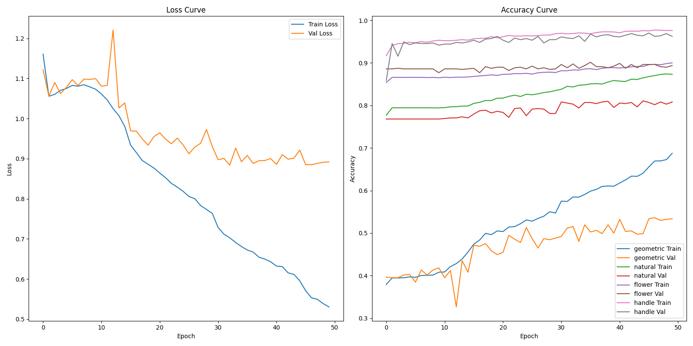

像分类数据集与多任务学习模型**


## 项目简介

ChaHu 是一个专注于紫砂壶图像分类的数据集和深度学习项目。该项目包含：
- **大规模紫砂壶图像数据集**：包含超过9000张紫砂壶图像及对应的mask遮罩
- **多任务学习模型**：基于SE-ResNet-34实现四个任务的联合分类

### 数据来源
- 数据集托管于 Hugging Face Datasets：[AGI-FBHC/ChaHu](https://huggingface.co/datasets/AGI-FBHC/ChaHu)

### 数据集结构

| 字段 | 类型 | 描述 |
|------|------|------|
| `id` | string | 图像唯一标识符（如 JN000001） |
| `image` | image | 紫砂壶图像 |
| `mask` | image | 图像遮罩，用于提取壶体区域 |
| `geometric shape type` | string | 几何形状类型 |
| `natural shape type` | string | 自然形状类型 |
| `flower type` | string | 花卉类型 |
| `handle type` | string | 把手类型 |
| `innovative` | string | 是否创新 |
| `caption` | string | 描述文字 |
| `time` | string | 时间信息 |

数据集下载 [AGI-FBHC/ChaHu · Datasets at Hugging Face](https://huggingface.co/datasets/AGI-FBHC/ChaHu)

准备工作：

1.将下载的数据集中CN-00000-of-00003.parquet，CN-00001-of-00003.parquet，CN-00002-of-00003.parquet三个文件复制到该目录下。

### 运行脚本

\```bash

python process.py

python main.py

\```

1. 运行 `process.py`，通过掩码提取紫砂壶图像有效区域，处理后在 `process` 目录下生成三个新文件：`CN-00000-of-00003-new.parquet`、`CN-00001-of-00003-new.parquet`、`CN-00002-of-00003-new.parquet`。

2. 运行 `main.py`，完成**数据集划分、模型构建、多任务训练**全部流程：

- 对处理后的数据集按照 **72% 训练集、8% 验证集、20% 测试集** 进行划分，以几何形状类型geometric shape为依据执行**分层抽样**，确保各子集类别分布与原始数据集保持一致；
- 基于 **SE-ResNet-34** 构建紫砂壶多任务分类模型，**同时完成四大分类任务**：几何形状、自然形状、花卉类型、把手类型；
- 引入 **SE（Squeeze-and-Excitation）注意力机制** 提升关键特征的表达能力；
- 采用**动态任务权重策略**，根据各任务在验证集上的准确率自动调整训练优先级，实现多任务协同优化。

项目支持四个并行分类任务：

| 任务 | 描述 | 示例类别 |
|------|------|----------|
| **几何形状** | 壶的整体几何形态 | 石瓢壶，仿古壶，汉铎壶等 |
| **自然形状** | 模仿自然形态 | 南瓜壶，竹节壶，莲子壶等 |
| **花卉类型** | 花卉装饰图案 | 梅桩壶、供春壶、佛手壶等 |
| **把手类型** | 壶把手的样式 | 三叉提梁壶，单式提梁壶，软提梁壶 |

## **项目结构**

```
ChaHu/
├── process/
|	├── CN-00000-of-00003-new.parquet # process.py脚本通过mask处理后的文件
|	├── CN-00001-of-00003-new.parquet
|	├── CN-00002-of-00003-new.parquet
├── main.py              # 主训练脚本（多任务SE-ResNet）
├── process.py           # 数据预处理脚本
└── README.md
```
## 模型设计

模型结构


### 使用模型 SE-ResNet-34

本项目采用 SE-ResNet-34 作为多任务学习的共享特征提取主干网络，通过 SE（Squeeze-and-Excitation）注意力模块实现通道特征权重的自适应校准。SE 模块先通过全局平均池化对空间特征进行压缩，得到通道级全局描述符；再经由两层全连接层建模通道间的非线性相关性，最终利用 Sigmoid 激活函数生成通道注意力权重。该机制可有效强化关键特征通道、抑制冗余信息，增强模型对紫砂壶几何轮廓、纹理细节等细微视觉特征的提取与表达能力。网络的四个任务分支（几何形状、自然形状、花卉类型、把手类型）共享同一主干特征，实现多任务间的信息互补与知识迁移。

### 动态任务权重机制

为解决多任务学习中任务优化不均衡、收敛速度不一致的问题，本项目设计并实现了**基于验证集准确率的动态任务权重策略**，具体实现如下：

1. **动态权重计算**

   以各任务在验证集上的准确率为依据，对表现较差的任务自动分配更高权重。

   首先通过 `1 - acc` 得到任务难度系数，归一化后作为动态修正项；

   再将基础权重与动态项加权融合，得到最终任务权重：

   task_weight=0.7×base_weight+0.3×inv_acc

   其中 `base_weight` 初始化为 `[0.25, 0.25, 0.25, 0.25]`，保证训练初期稳定。

2. **训练控制策略**

   - **hybrid 混合模式**：采用历史权重与当前权重平滑融合（`0.9×历史 + 0.1×新计算`），使权重更新更平滑、训练更稳定，避免权重剧烈波动。

该机制能够在训练过程中**自动聚焦困难任务**，使四个分类任务均衡优化，显著提升模型整体收敛稳定性与最终分类精度。

关键代码：

```
# 根据验证准确率动态调整任务权重
def dynamic_task_weight(val_accs, base_weights=[0.25, 0.25, 0.25, 0.25]):
    # 表现差的任务分配更高权重
    inv_accs = [1 - acc for acc in val_accs]
    inv_accs = [w / sum(inv_accs) for w in inv_accs]
    # 混合权重
    weights = [0.7 * base + 0.3 * inv for base, inv in zip(base_weights, inv_accs)]
    return weights

# 根据验证准确率动态调整任务权重（从第二个epoch开始）
        if epoch > 0 and use_dynamic_weights:
            if weight_adjust_method == 'accuracy':
                task_weights = dynamic_task_weight(current_val_accs)
            elif weight_adjust_method == 'hybrid':
				# acc_weights为动态任务权重，task_weights为包含acc_weights的历史状态，实现平滑过渡
                acc_weights = dynamic_task_weight(current_val_accs)
                task_weights = [0.9 * a + 0.1 * s for a, s in zip(task_weights, acc_weights)]
```

### 训练参数配置（可在脚本中修改）：

| 参数          | 默认值 | 描述           |
| ------------- | ------ | -------------- |
| BATCH_SIZE    | 64     | 批次大小       |
| LEARNING_RATE | 3e-4   | 学习率         |
| NUM_EPOCHS    | 10     | 训练轮数       |
| IMAGE_SIZE    | 224    | 图像尺寸       |
| TEST_SIZE     | 0.2    | 测试集比例     |
| LR_STEP_SIZE  | 15     | 学习率衰减步长 |
| LR_GAMMA      | 0.5    | 学习率衰减系数 |

### 模型输出

训练完成后会生成：
- `multitask_best.pth` - 最佳验证准确率模型
- `multitask_final.pth` - 最终训练模型
- `multitask_training_curves_resnet_*.png` - 训练曲线图

## 训练效果如下所示


