# **基于ChaHu的几何性质分类模型**


## 项目简介

本项目是一个专注于紫砂壶图像分类的数据集和深度学习项目。该项目包含：
- **大规模紫砂壶图像数据集**：包含超过9000张紫砂壶图像及对应的mask遮罩
- **多任务学习模型**：基于SE-ResNet-34动态配置inception多尺度卷积，实现四个不同角度（几何形状、自然形状、花卉类型、把手类型）的紫砂壶几何类型分类

## 数据集说明

- 数据集托管于 Hugging Face Datasets：[AGI-FBHC/ChaHu](https://huggingface.co/datasets/AGI-FBHC/ChaHu)
- 具体下载方法见README目录下的'紫砂壶数据集.md'
- 数据集准备工作：将下载的数据集CN-00000-of-00003.parquet，CN-00001-of-00003.parquet，CN-00002-of-00003.parquet三个文件复制到该目录下。


## 数据集结构

| 字段 | 类型 | 描述 |
|------|------|------|
| `id` | string | 图像唯一标识符（如 JN000001） |
| `image` | image | 紫砂壶图像 |
| `mask` | image | 图像遮罩，用于提取壶体区域 |
| `geometric shape type` | string | 几何形状类型 |
| `natural shape type` | string | 自然形状类型 |
| `flower type` | string | 花卉类型 |
| `handle type` | string | 把手类型 |
| `innovative` | string | 是否创新 |
| `caption` | string | 描述文字 |
| `time` | string | 时间信息 |

## **项目结构**

```bash
ChaHu/
├── data_split # 分隔训练集和测试集
├── image      # readme使用到的一些图片
├── image_save # 保存的训练结果
├── model_save # 保存的模型 
├── process/
|	├── CN-00000-of-00003-new.parquet # process.py脚本通过mask处理后的文件
|	├── CN-00001-of-00003-new.parquet
|	├── CN-00002-of-00003-new.parquet
├── vis_results   # 保存的测试结果
├── main.py       # 主训练脚本（多任务SE-ResNet）
├── process.py    # 数据预处理脚本
├── README.md
├── test_model.py #数据集测试脚本
└── test_pic.py   #图像mask处理图示测试脚本
```
## 模型结构

* 本项目参考的基础模型为ResNet，考虑到数据集有9000多张图片，小数据集易过拟合，同时需要兼顾训练效果，网络需具有一定深度，故采用ResNet34作为图像分类的基础模型。

  下面是ResNet结构示意图：

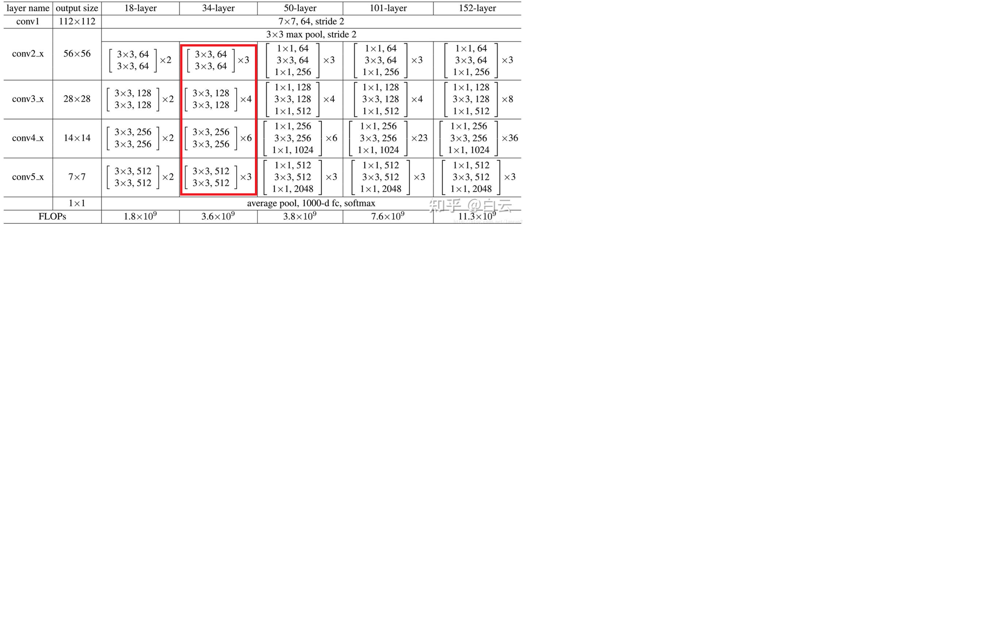


* **加入SE注意力模块**，记上图中ResNet的conv2-5为layer1-4，SE添加在ResNet的layer1-4层，共4层SE
* 加入SE模块原因：考虑到茶壶类间差异小：不同壶型（石瓢、仿古、德钟等）轮廓接近，主要靠细微曲线、口盖比例、流把角度区分。

* 特征集中在纹理 / 色泽：紫砂泥料的颗粒质感、窑变色泽、包浆光泽，这些信息分散在不同特征通道里。
* ResNet的卷积输出的所有特征通道权重相同，不会自动区分 “重要通道”（如纹理、边缘）和 “没用通道”（如背景噪声、冗余特征)。紫砂壶分类这种细节敏感、通道信息差异大的任务，ResNet 提取的特征判别力不足。给ResNet加上SE模块，通道“注意力”，自动放大纹理 / 色泽 / 轮廓通道权重，压低背景、反光、划痕等无效通道。且SE作为轻量级模块，直接在 ResNet34后插入SE，不用改主体结构。

* **借鉴GoogLenet的inception模块**，将ResNet的layer3改为inception卷积并行融合模块。

* 考虑到紫砂壶的器型差异靠轮廓特征，如整体比例、口盖线条、流把弧度需要大感受野、粗粒度特征。而有些特征是颗粒粗细、窑变斑点、光泽质感，需要小感受野、细粒度特征。所以采用多尺度特征。

* 考虑到ResNet浅层主要做边缘、纹理、基础特征提取，而且浅层特征图尺寸大，多分支计算量开销会被放大，性价比低。

  中深层的特征图尺寸适中，通道数（256）也足够支撑多分支并行。这里的特征已经有一定语义信息，多分支可以帮模型捕捉更丰富的上下文和不同尺度的语义关联，对分类、检测等任务提升明显。所以选择将ResNet的layer3改为inception卷积并行融合模块。

* 添加Inception 块：
  1×1：抓细微纹理、颜色、斑点
  3×3：抓局部边缘、小弧度、流把转折
  5×5：抓整体轮廓、口盖比例、器型大结构
  输出直接拼接，同时保留多尺度信息，特征更丰富、判别力更强

* 本模型将ResNet中的layer两个卷积conv 3×3改为conv 1×1， 3×3， 5×5 多尺度卷积。池化后用 1×1 卷积调整通道，保证和其他分支输出通道数一致。

* **模型整体结构如下**

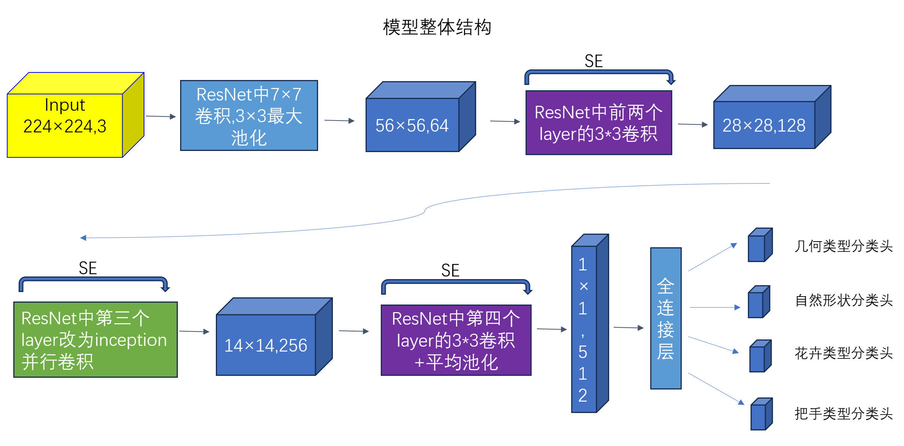


## 训练步骤

1. 运行 `process.py`，通过掩码提取紫砂壶图像有效区域，处理后在 `process` 目录下生成三个新文件：`CN-00000-of-00003-new.parquet`、`CN-00001-of-00003-new.parquet`、`CN-00002-of-00003-new.parquet`。

   * 提取紫砂壶有效区域效果图如下所示

   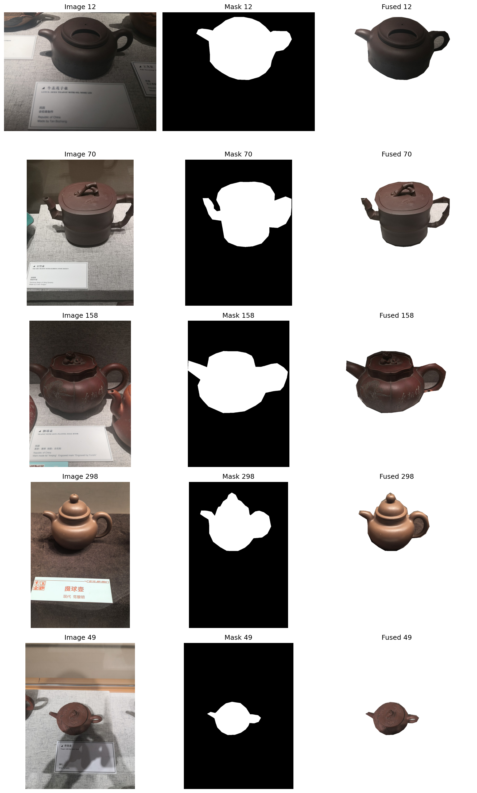

2. 运行 `main.py`，完成**数据集划分、模型构建、多任务训练**全部流程：

- 对处理后的数据集按照 **72% 训练集、8% 验证集、20% 测试集** 进行划分，以几何形状类型geometric shape为依据执行**分层抽样**，确保各子集类别分布与原始数据集保持一致；

- 基于 **SE-ResNet-34** 加入并行卷积构建紫砂壶多任务分类模型，**同时完成四大分类任务**：几何形状、自然形状、花卉类型、把手类型；

  项目支持四个并行分类任务：

| 任务         | 描述             | 示例类别                         |
| ------------ | ---------------- | -------------------------------- |
| **几何形状** | 壶的整体几何形态 | 石瓢壶，仿古壶，汉铎壶等         |
| **自然形状** | 模仿自然形态     | 南瓜壶，竹节壶，莲子壶等         |
| **花卉类型** | 花卉装饰图案     | 梅桩壶、供春壶、佛手壶等         |
| **把手类型** | 壶把手的样式     | 三叉提梁壶，单式提梁壶，软提梁壶 |

* 采用**动态任务权重策略**，根据各任务在验证集上的准确率自动调整训练优先级，实现多任务协同优化。

### 训练参数配置（可在脚本中修改）：

| 参数          | 默认值 | 描述           |
| ------------- | ------ | -------------- |
| BATCH_SIZE    | 64     | 批次大小       |
| LEARNING_RATE | 3e-4   | 学习率         |
| NUM_EPOCHS    | 10     | 训练轮数       |
| IMAGE_SIZE    | 224    | 图像尺寸       |
| TEST_SIZE     | 0.2    | 测试集比例     |
| LR_STEP_SIZE  | 15     | 学习率衰减步长 |
| LR_GAMMA      | 0.5    | 学习率衰减系数 |

* 同时代码支持配置替换卷积,可以替换途中ResNet34的layer1-4的卷积为 inception 多尺度卷积,代码如下

```python
# ==================== 模型配置参数 ====================
    # 每个层可独立配置为 'se' (SEBasicBlock) 或 'inception' (SEInceptionBasicBlock)
    # 示例配置：仅在 layer3 (conv4_x) 使用 Inception
    LAYER1_BLOCK = 'se'           # layer1 (conv2_x): 原始 SE 块
    LAYER2_BLOCK = 'se'           # layer2 (conv3_x): 原始 SE 块
    LAYER3_BLOCK = 'inception'    # layer3 (conv4_x): Inception 块（改进层）
    LAYER4_BLOCK = 'se'           # layer4 (conv5_x): 原始 SE 块
# ==================================================
```

​	3. 运行test_model.py，测试紫砂壶4个分类头的准确率，输出分类概率图。

### 模型输出

训练完成后会生成：

- `model_save/multitask_best.pth` - 最佳验证准确率模型
- `model_save/multitask_final.pth` - 最终训练模型
- `image_save/multitask_training_curves_resnet_*.png` - 训练曲线图
- `vis_results/best_correct_*.png` - 测试集结果图

## 实验结果 

* 训练效果如下所示

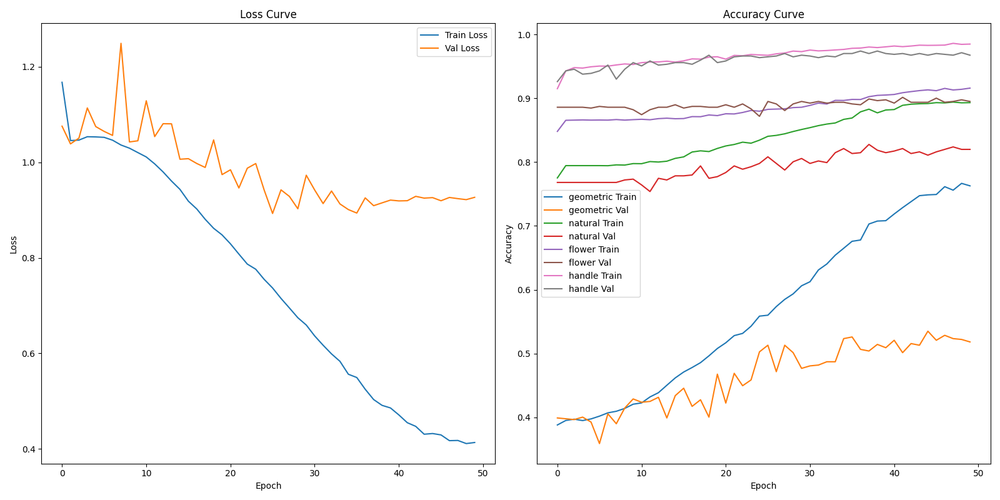

* 测试结果

  | 紫砂壶分类头 | 任务准确率 |
  | ------------ | ---------- |
  | **几何形状** | **0.540**  |
  | **自然形状** | **0.837**  |
  | **花卉类别** | **0.887**  |
  | **把手类型** | **0.964**  |

  由于**几何形状**分类头包含紫砂壶壶型最多，且对于一些相似形状茶壶较难分辨，所以任务准确率最低。**把手类型**分类头包含紫砂壶壶型最少，且容易分辨，所以任务准确率最高。

* 下面是抽取的紫砂壶的各类别概率分布
* **几何形状类：**


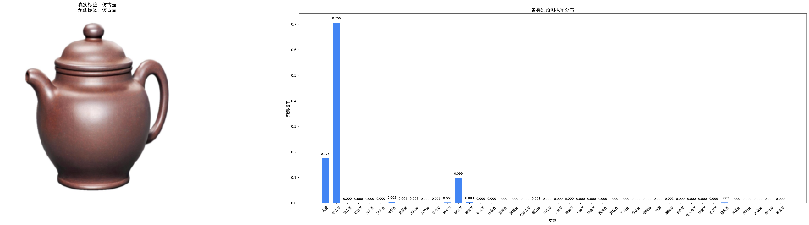

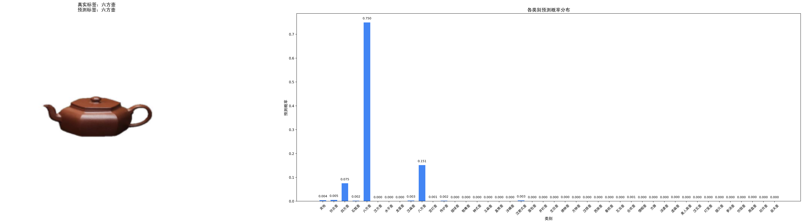

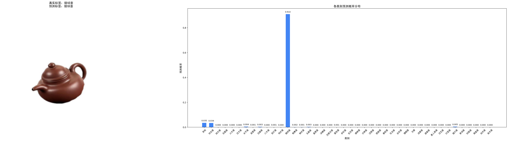

* **自然形状类：**

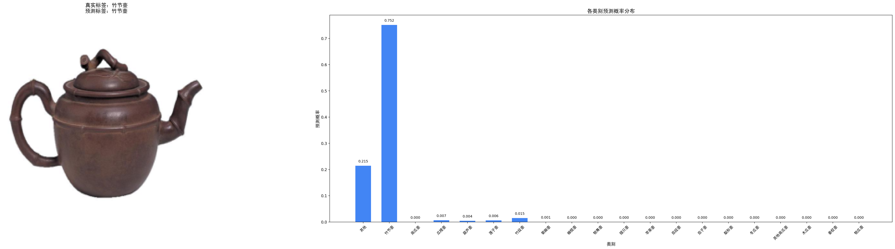

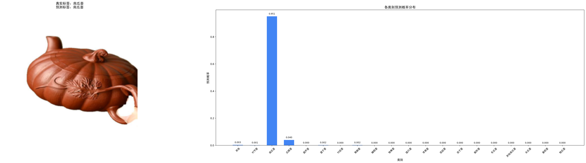

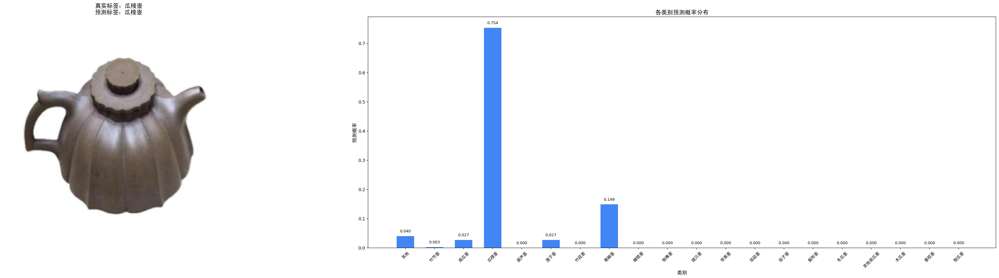

* **花卉类别：**

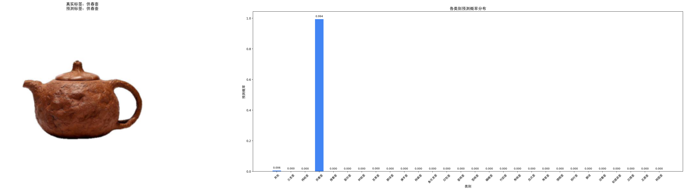

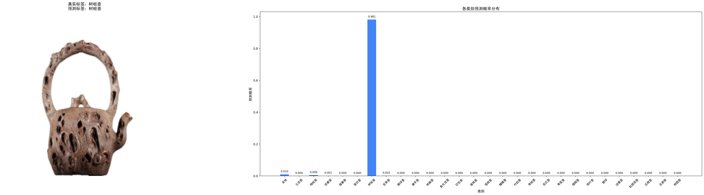

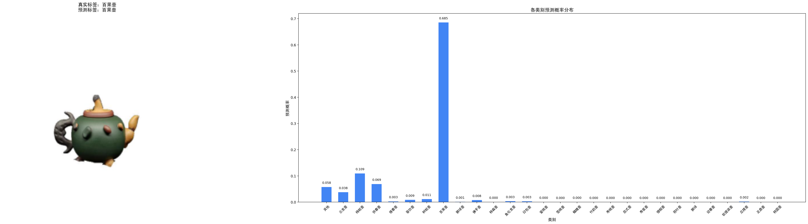

* **把手类型：**

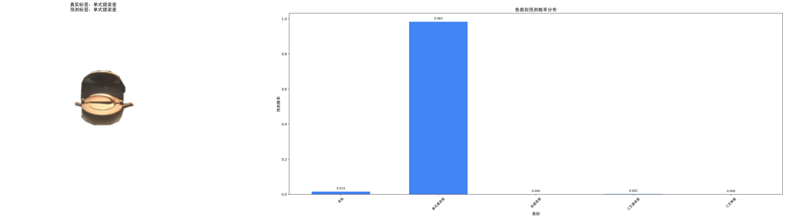

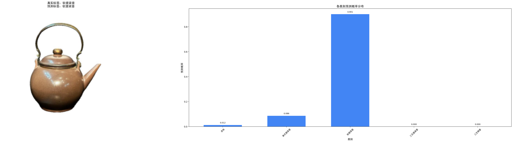

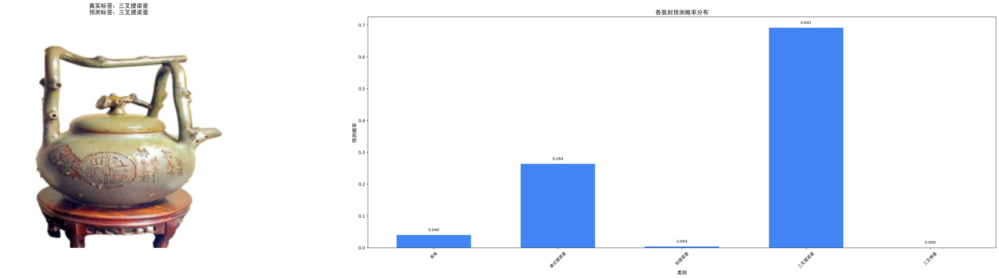

## 核心代码说明

### 动态任务权重机制

为解决多任务学习中任务优化不均衡、收敛速度不一致的问题，本项目设计并实现了**基于验证集准确率的动态任务权重策略**，具体实现如下：

1. **动态权重计算**

   以各任务在验证集上的准确率为依据，对表现较差的任务自动分配更高权重。

   首先通过 `1 - acc` 得到任务难度系数，归一化后作为动态修正项；

   再将基础权重与动态项加权融合，得到最终任务权重：

   task_weight=0.7×base_weight+0.3×inv_acc

   其中 `base_weight` 初始化为 `[0.25, 0.25, 0.25, 0.25]`，保证训练初期稳定。

2. **训练控制策略**

   - **hybrid 混合模式**：采用历史权重与当前权重平滑融合（`0.9×历史 + 0.1×新计算`），使权重更新更平滑、训练更稳定，避免权重剧烈波动。

该机制能够在训练过程中**自动聚焦困难任务**，使四个分类任务均衡优化，显著提升模型整体收敛稳定性与最终分类精度。核心代码如下：

```python
# 根据验证准确率动态调整任务权重
def dynamic_task_weight(val_accs, base_weights=[0.25, 0.25, 0.25, 0.25]):
    # 表现差的任务分配更高权重
    inv_accs = [1 - acc for acc in val_accs]
    inv_accs = [w / sum(inv_accs) for w in inv_accs]
    # 混合权重
    weights = [0.7 * base + 0.3 * inv for base, inv in zip(base_weights, inv_accs)]
    return weights

# 根据验证准确率动态调整任务权重（从第二个epoch开始）
        if epoch > 0 and use_dynamic_weights:
            if weight_adjust_method == 'accuracy':
                task_weights = dynamic_task_weight(current_val_accs)
            elif weight_adjust_method == 'hybrid':
				# acc_weights为动态任务权重，task_weights为包含acc_weights的历史状态，实现平滑过渡
                acc_weights = dynamic_task_weight(current_val_accs)
                task_weights = [0.9 * a + 0.1 * s for a, s in zip(task_weights, acc_weights)]
```

### 数据增强

```python
# 数据增强
train_transform = transforms.Compose([
    transforms.Resize((IMAGE_SIZE + 32, IMAGE_SIZE + 32)),  # 先放大到目标尺寸+32
    transforms.RandomCrop((IMAGE_SIZE, IMAGE_SIZE)),        # 随机裁剪到目标尺寸
    transforms.RandomHorizontalFlip(p=0.5),                 # 随机水平翻转（50%概率）
    transforms.RandomVerticalFlip(p=0.2),                   # 随机垂直翻转（20%概率）
    transforms.RandomRotation(20),                          # 随机旋转±20度
    transforms.ColorJitter(brightness=0.2, contrast=0.2, saturation=0.2, hue=0.1),  # 颜色抖动
    transforms.ToTensor(),                                  # 转换为张量
    transforms.Normalize(mean=[0.485, 0.456, 0.406], std=[0.229, 0.224, 0.225])  # 归一化（ImageNet均值/标准差）
])

val_test_transform = transforms.Compose([
    transforms.Resize((IMAGE_SIZE, IMAGE_SIZE)),            # 直接resize到目标尺寸
    transforms.ToTensor(),                                  # 转换为张量
    transforms.Normalize(mean=[0.485, 0.456, 0.406], std=[0.229, 0.224, 0.225])  # 归一化
])
```

### AdamW优化器+余弦退火

```python
# 优化器
criterion = nn.CrossEntropyLoss()
optimizer = optim.AdamW(model.parameters(), lr=LEARNING_RATE, weight_decay=WEIGHT_DECAY) # AdamW优化器
scheduler = optim.lr_scheduler.StepLR(optimizer, step_size=LR_STEP_SIZE, gamma=LR_GAMMA) # 余弦退火
```

